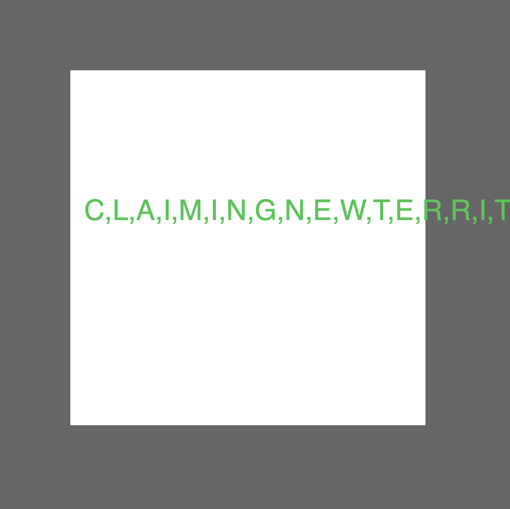

**Week 10**

Over the week I kept playing with the two sketches trying to morph them into one. A few problems have come up, and I'm beginning to think that this maybe isn't the smartest way around my problem!! Karen was very helpful in her suggestions mentioning to continue the use of classes, and to use the sentence.split factor. I kept with my stratergy of slowly switching out numbers and words to hopefully get to where I wanted to go, but they didn't work the way I wanted, hence don't have muchn to show for this week, buuut below is what I ended up with! Watch it [here](https://rubybrown101.github.io/codewordsstudio/SKO1/WEEK10/sketch__C_InSquare)

A very frustrating week! Although it's not quite where I had hoped to be buy now, it is slightly heading towards what I envision my final project to look like. 

[WEEK 9](https://github.com/rubybrown101/codewordsstudio/tree/master/SKO1/week9) [WEEK 11](https://github.com/rubybrown101/codewordsstudio/tree/master/SKO1/week11)
