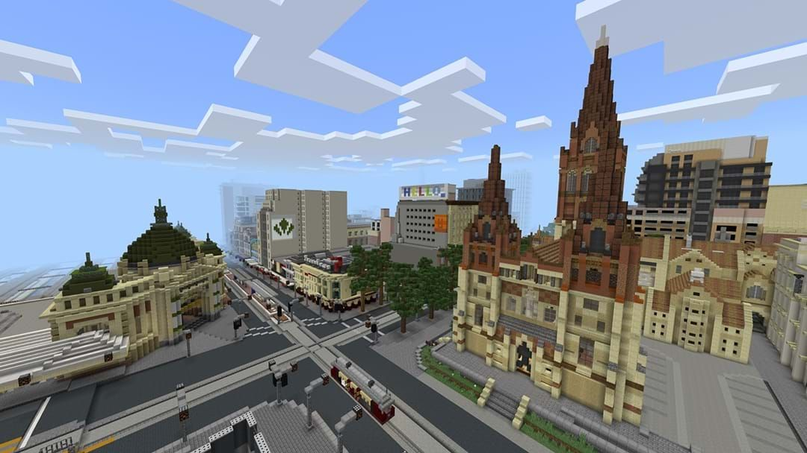
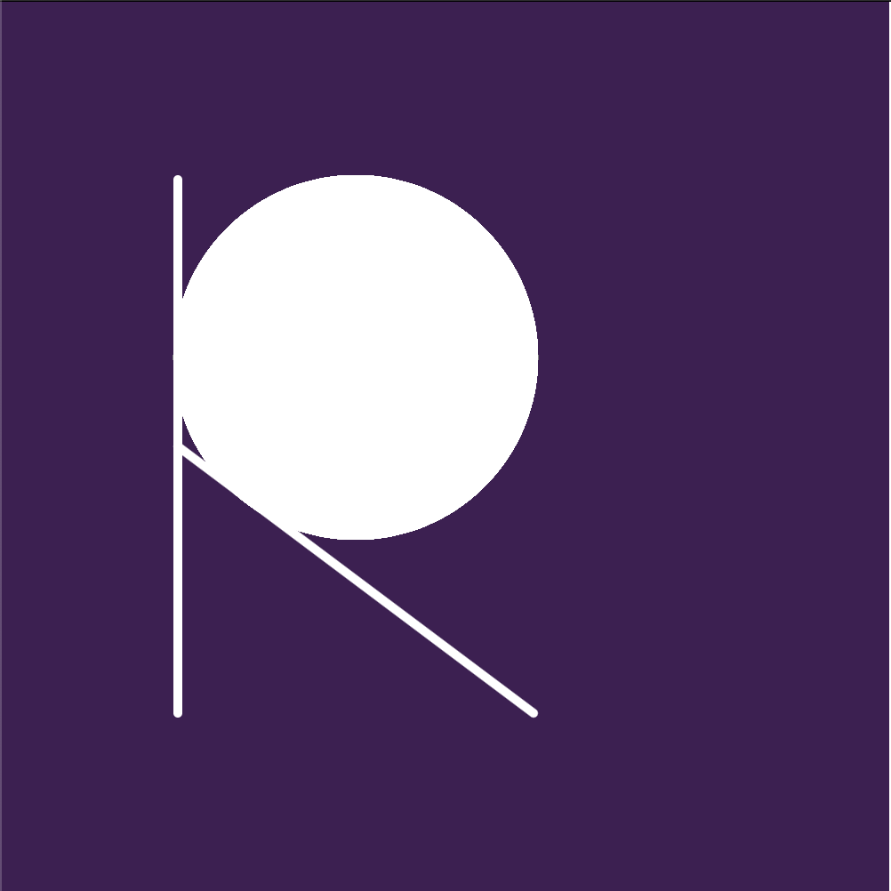
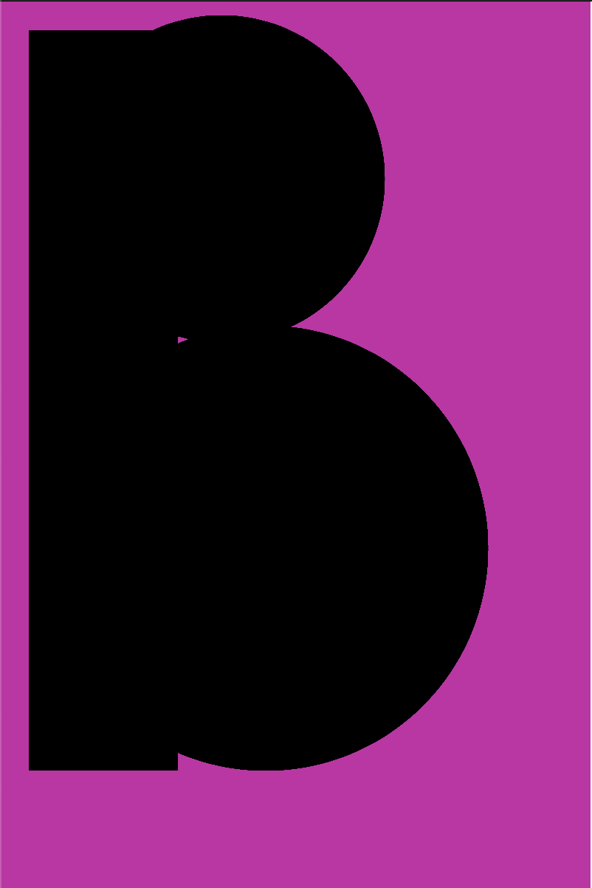
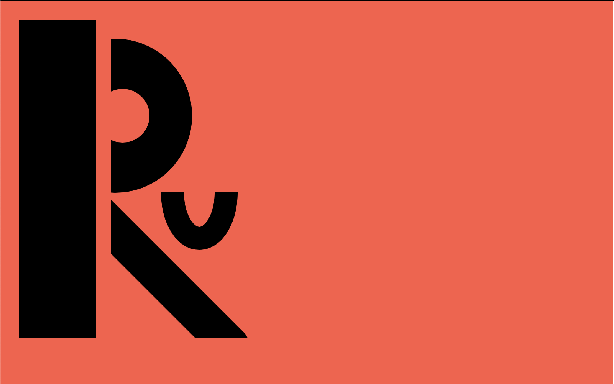

**Week !**

The first class was a lot of fun, we all got to explore the Melbourne CBD in minecraft and get used to having real life experiences in a virtual space. It was great to reconnect with the people I knew before this sem, and to meet new people on this cool platform. It was also so nice to be able to explore the streets of Melbourne again! Below is the mini Melbourne Minecraft world we got to explore, the image shown below was sourced from Hit.FM

Next we started to explore the world of code, and get into very basic, static graphics. Below is what we got up to during class and as homework. 

As this was my first introduction to coding ever, I was really excited to learn all about the platform and see what it had to offer. We went throught the basics such as createCanvas, choosing your background, creating basic shapes and the use of (mouseX, mouseY) (I was in awe of this!!). Although extremely daunting, it was great to get into p5.js and see what we could do. For homework, we were to create our initials on the platform, which is what you can see above. I did struggle to place the objects where I wanted them, but after Andy suggested to look at the p5.js website it was a lot easier to understand how to make the platform work as I wanted it to! 

[WEEK 2] (
