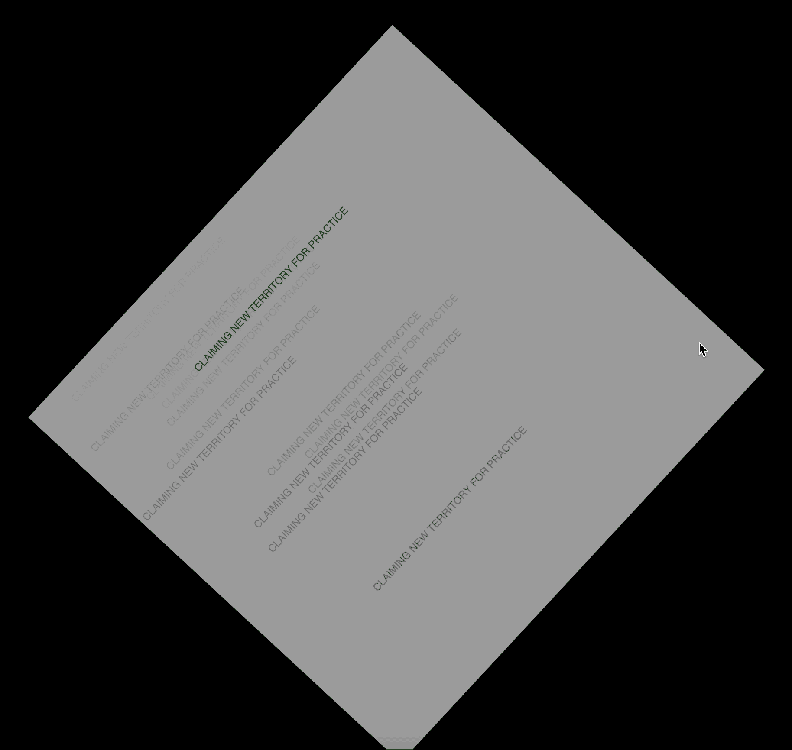
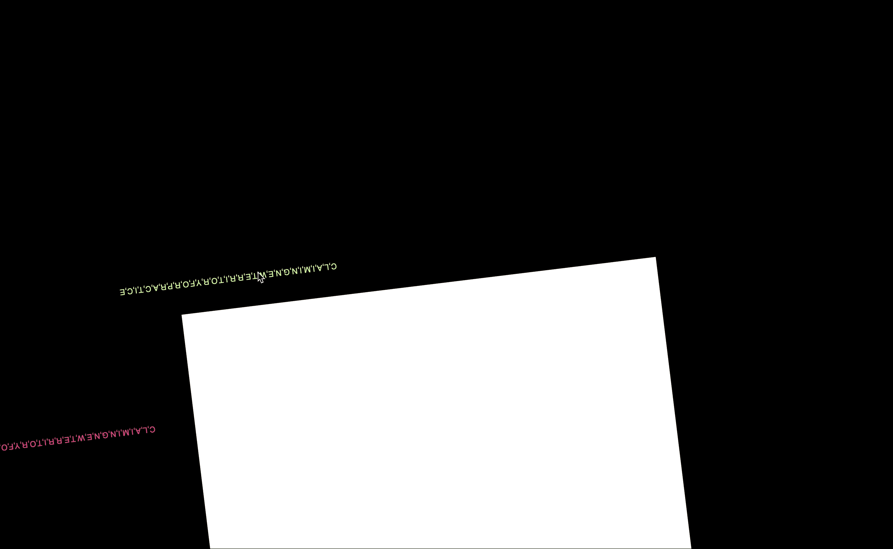

**Week 11**

This week in class we continued to work on our final projects in class. We broke up into breakout rooms where we could solve our problems with other students, 
and with Karen and Andy when they were free. This weeks discussions were so helpful, and made me relax a bit when I was really not too happy with where my sketch was at.

After having separate discussions with Karen and Celia, I decided that i should simplify my sketch and just work with what I knew. This was a bit daunting, especially after seeing how insane the other students works were turning out! At the end of the week I hadf two sketches going, here they are!

Time to simplify and see where we end up!
