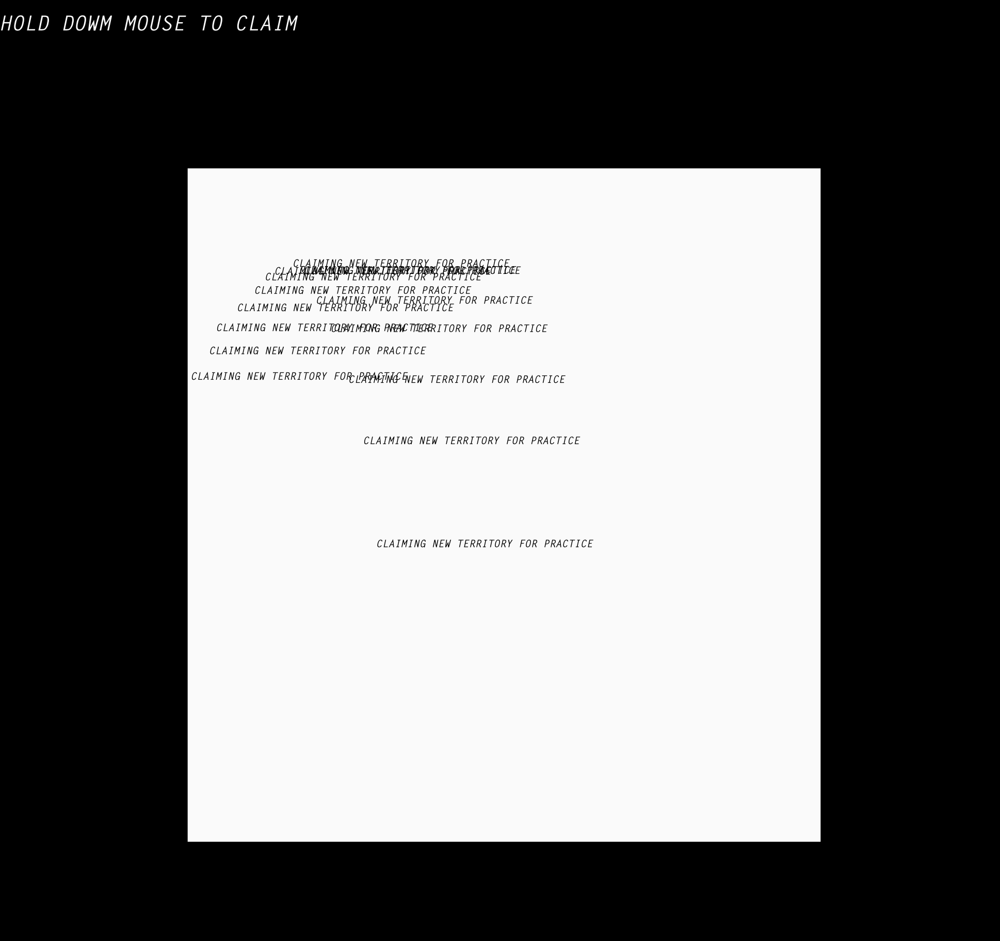

**WEEK 12!!!!**

A very daunting, yet exciting week! Its been a long 12 weeks, but reflecting on it now I realise how much I have learnt and am very proud of how far I have come. 

My final sketch, named 'CLAIMED', is a lot simpler than I had initially wanted, but I am happy with the outcome. Below is a screenshot of the final piece, but have a play around with it [here](https://rubybrown101.github.io/codewordsstudio/SKO1/week12/CLAIMED/)

'Price attempts to question contemporary art and the boundaries that have been placed on the practice over time, and what it would mean to step outside these boundaries over time. He describes contemporary art as being an art form the is 'radically uncomplete'.' This brief overview of the book I wrote back on the 20th of August explores the reasoning behind a lot of my choices. The white box symbolises the boundries contemporary art is stuck in, often taking an extra ordinary experience or relationship (wether it be with another human, object or something completely different) to break free of it. This expereince is relationship is simulated by holding down the mouse, where the type explodes into a green colourful typeface. This transformation represents the claiming of new territory, and was were the idea for the name 'CLAIMED' came from. 

The initial idea came from breaking free of social constructs and boundaries that are often prominent in everyday life, but also very much within the design community. The sentence ‘Claiming new territory for practice’ really stood out to me, being such a strong and bold statement, while still using everyday, simple language meant it could have a larger reach, while still communicating the poignant meaning behind the sentence to every single viewer. The sentence influenced my decision to use my past knowledge on type to explore ways to claim ‘new territory’. Using this concept as a basis I explored the platform to find a way to visually portray the concept, in a piece I could create. Finally I created an interactive platform where people can dictate the territory they claim, through the altering gravitational pull, changing typeface, colours and use of negative space. 

After a person plays around with the code, and has a chance to respond to it, I would love them to walk away feeling a little confronted by the barriers they have been living alongside. My year 12 Visual Arts teacher, Bill Tink, told us ‘Art should comfort the disturbed, and disturb the comfortable’, which I think sums up pretty perfectly what I am trying to achieve with my code. 
