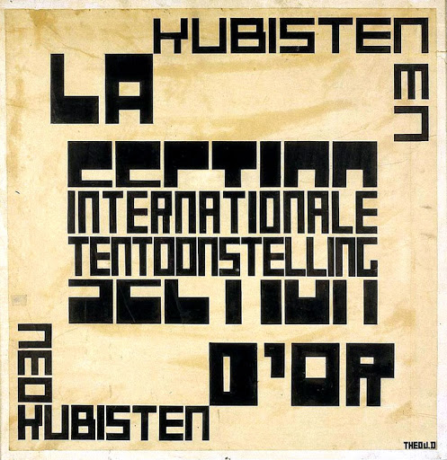
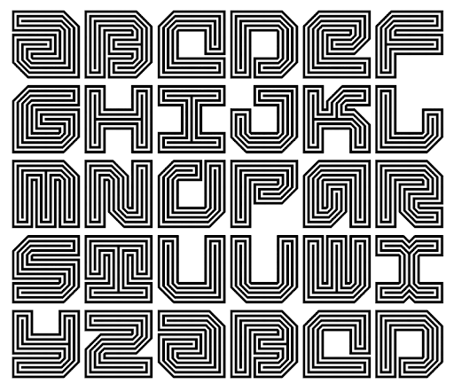
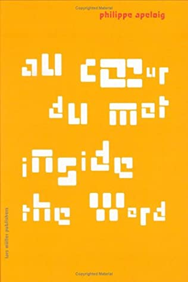
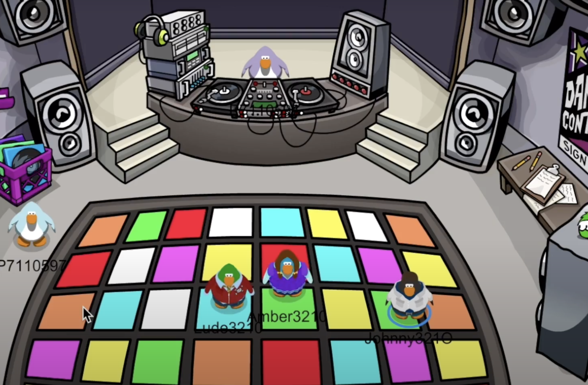

**Hello and Welcome to week2!**

This week we entered the world of Modular Typography, and what an exciting world it is! Modular Typography can be defined as 'an alphabet constructed from a limited amount of shapes'.  

We studied typographers and there work, such as Theo van Doesburg, Jurriaan Schrofer and Phillipe Apeloig. I have attached some of there works below. 

Theo van Doesburg was a Dutch artist, who practiced in the late 19 Century to early 20 Century.  He was a part of the 'De Stijl' group who believed in making universal language, focusing on the horizontal and verticle lines and primary colours. Below is the cover of the first 'De Stijl' magasine, designed by Van Doesburg. It is suggested that his co-worker Vilmos Huszar helped on the cover. 

Juriaan Schrofer, also a Dutch Typographer, practiced in the mid to late 20th Century.Previously described as 'A computer designer before computers' ( by Frederike Hyugen), Schrofer was revolutionary in the world of graphic design. He worked on projects for clients such as Stedelijk Museum and The National Post Office, and designed typefaces made to measure to be a part of his own designs. Below is an example of his work, designed way ahead of his time. 

Phillipe Apeloig is a graphic designer who has been in the industry since the late 20th Century, working for huge companies such as Musee d'Orsay and the Louvre. Apeloig is known for his vibrant, dynamic typography that seems to 'dance' across the page. He uses screen printing to explore the world of typogrpahy past the computer generated platform and bring it into a deeper demention. Below is an example of Apeloig's revolutionary works.

**Assessment 2 Begins**

This week we started our assignment, where we delved into the world of House of Leaves. My group consisted of Celia, Hamish, Fergus and myself, we were assigned chapter 4. We decided to explore this chapter through Club Penguin, it's been fun remeniscing on our childhood hours playing the games together! 

[WEEK 1](https://github.com/rubybrown101/codewordsstudio/tree/master/SKO1/week1) [WEEK 3](https://github.com/rubybrown101/codewordsstudio/tree/master/SKO1/week3)
