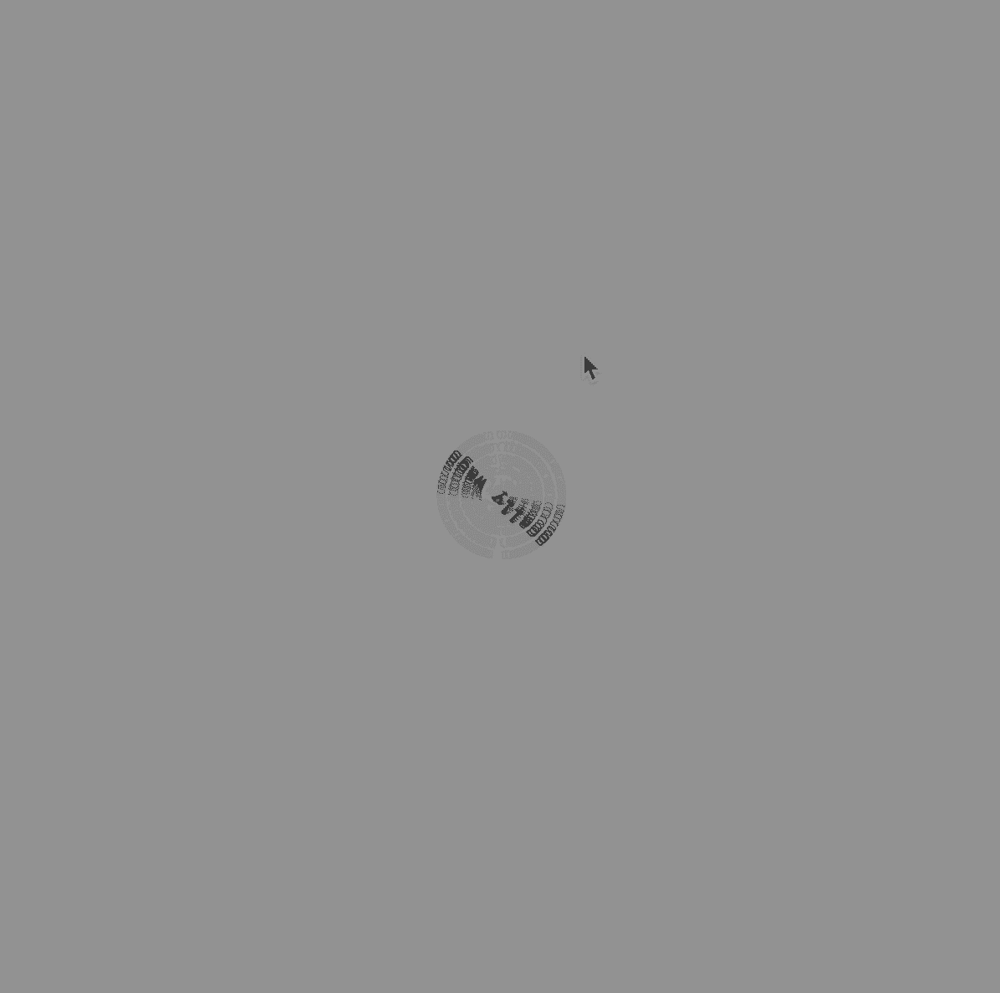

**Week 4**

This week in class we started working with type in p5.js. We learnt about the preload function which allowed us to use differnt typefaces within the sketch. This was really exciting for me, as it felt as though we were making movements in our learning! We were also introduced to the spinning feature, and were taught how to adjust it with radius and degrees. Below is my sketch of the week!

Reflecting on this week, I think it was probably the start of where I really started to struggle with the platform. While I thought I understood everything that was going on, and was so excited to learn about this new platfrom, looking back while designing my final assignment I realised there were so many basics that went over my head. 

**Assignment 2**

This week we starteds to act out the scenes in Club Penguin, and realised the limitations with the platform such as the penguins can't display emotion, there is only one view point ever shown, 
