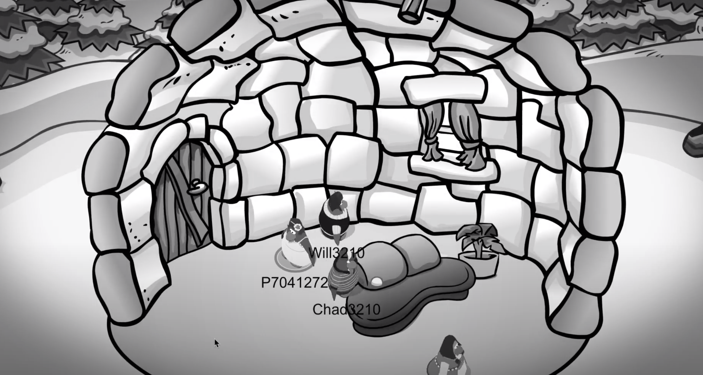

**Week 5!**

**Assignment 2**

This week we got to view all of the other groups assignments, I loved the variety of the works and how differently everyone chose to tell the story. It was great to see how passionate every obne was about their chapter, and to see the effort that had gone into each piece. 

Although a little confronting, I loved how our chapter turned out. I think Ferg, Hamish, Celia and I worked together very well as a group and were able to tell the story through the penguins and the setting, as well as the use of after effects quite effectively. I was really proud of 

**Coding**

Finishing our first assignment this week, I started to focus on our final assignment. I combed through the p5.js website and watched a few of 'The Coding train's' you tube videos to give myself a better idea of what is possible on the platform. I really liked the mouseX mouseY factor and the ability to draw on your screen. I played around with the feature, eventually creating this sketch. Although quite simple, I was excited by this finding and hope to use it in my final assignment to some degree... We will see!

[WEEK 4](https://github.com/rubybrown101/codewordsstudio/tree/master/SKO1/week4) [WEEK 6](https://github.com/rubybrown101/codewordsstudio/tree/master/SKO1/week6)
