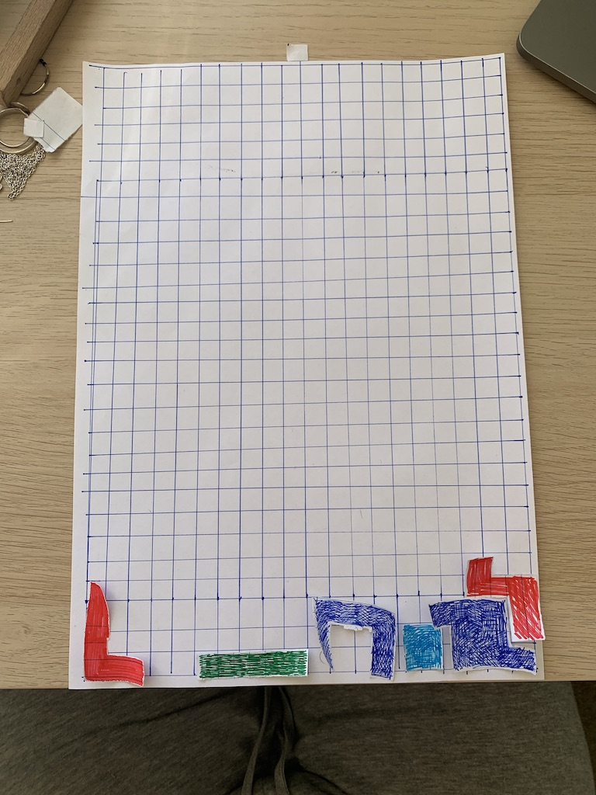

**Week 6**

Welcome to week 6! This weeks focus was paper prototypes and pseudocode. Initially we broke into groups and were to make paper prototypes of 90's video games, our group chose Tetris. It was fun to remenisce on the games I used to play when I was younger, and to haver a chat with people that weren't my family! 

I then made a paper prototype for what I wanted the final assignemnt end product  to look like. Price makes a statement within the first page stating 'Claiming new territory for practice' which, to me, encompasses the meaning behind the whole essay. He discusses how social pressures restrict modern art into the box, rather than outside. This concept is where my initial idea came from. My goal is to have each letter to spell out the quote 'Claiming new territory for practice' legible, before they fall and swivle around the box as the box rotates. 

**Pseudocode**

Our morning email from Andy was a pseudocode telling us to click the link at 9:30 with a coffee or tea, and then we were asked to make a pseudocode of our own. This was mine!:

Morning Routine:

START

IF 8 am;
THEN wake up and walk downstairs.

IF tired
THEN make big coffee;

IF not tired
THEN make small coffee;

IF coffee is finished;
THEN make breakfast;

THEN walk upstairs;

THEN shower;

THEN get changed;

END

**Code of the week**
This week we developed our work with type. We were taught how to add blocks of text, and to make it 
