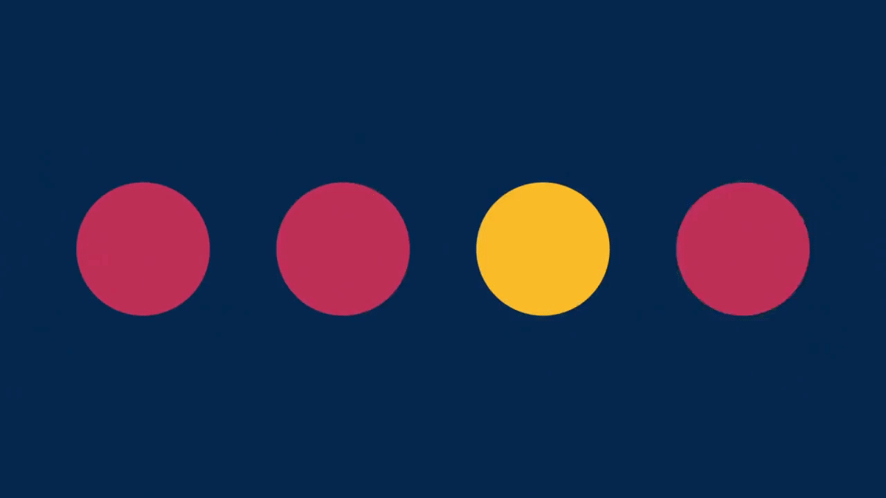
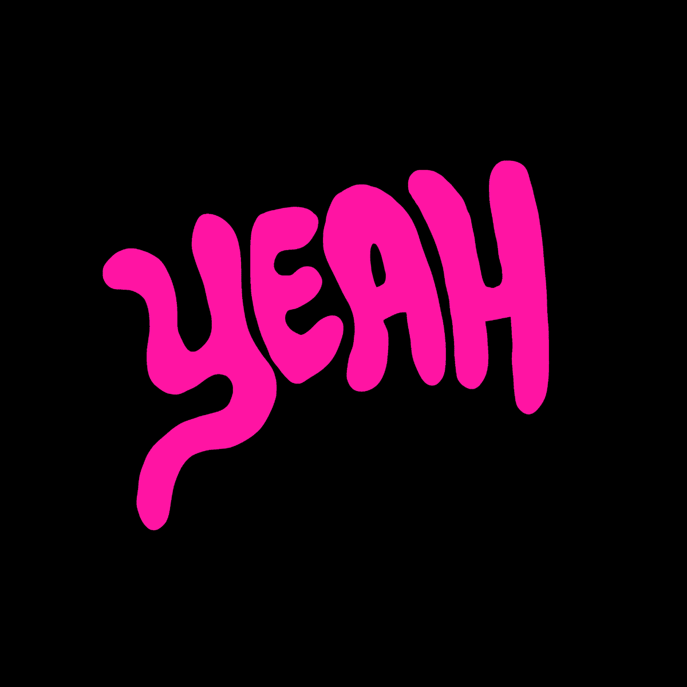
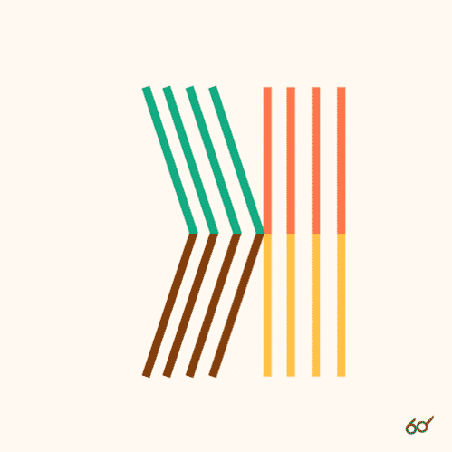
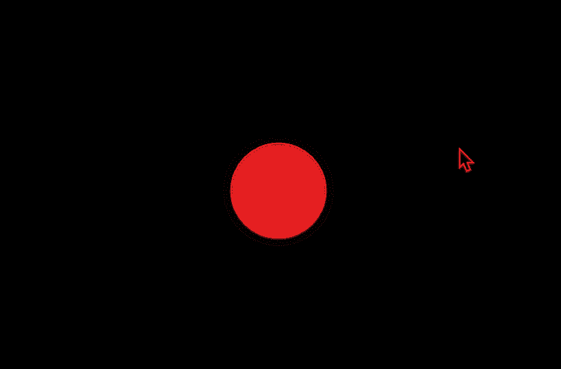

**Welcome to Week 7 and mid-sem**

Over the break I took a step back from playing around with p5.js and tried to dive into experimental uses of type, and E-Lit. I found some really cool examples that have inspired me to think outside the box. Below are a few I loved.

Although not directly typography, I thought it was a really cool idea to draw from other languages including morse code. 

In this GIF I thought the way the letters morph together to create new words was really interesting. It got me thinking about how this could become an interactive sketch in p5.js, maybe a toggle you can move up and down or as your mouse moves around the screen the words begin to morph. We will see what I can achieve. I sourced this GIF from https://giphy.com/gifs/yeah-right-chris-piascik-get-real-3o85xtVybcTRuiIO64.

This GIF caught my attention as I thought it could be something I could incorporate into my assignment. The lines could fall depending with the rotation of the box, instead of the whole letters. So much to think about and figure out how to do!!

**Class Week 7**

In class this week Karen showed us how to add sound to our sketch. I had not come across this yet in my research, and had no idea it was a possibility, so was very exciting to see how you can use it in the platform. We made this sketch below in class, following Karens instructions ofcourse!

[WEEK 6](https://github.com/rubybrown101/codewordsstudio/tree/master/SKO1/week6) [WEEK 8](https://github.com/rubybrown101/codewordsstudio/tree/master/SKO1/week8)
