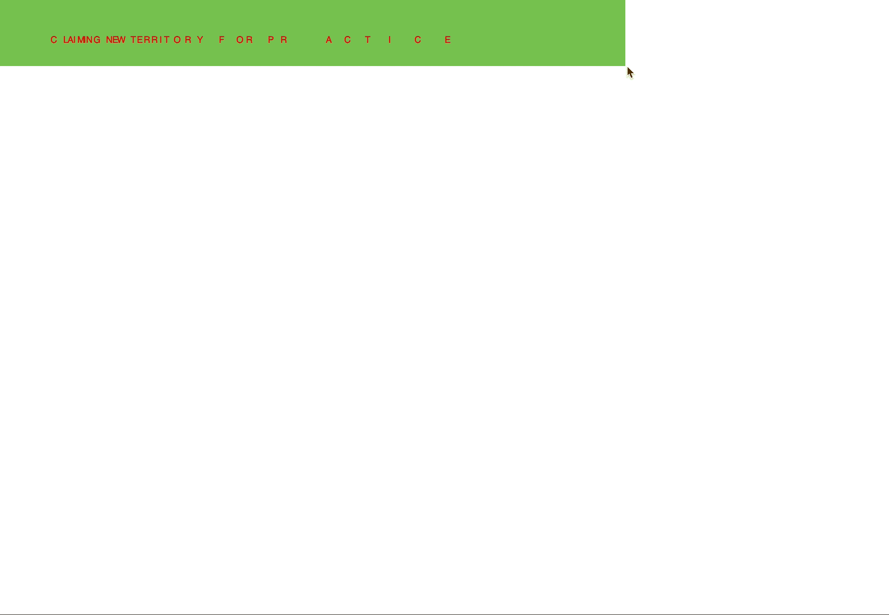

**Week 8**

This week consisted of many hours behind the screen trying to figure out how to use the class function, and to make forces apply to the objects within the screen.
Although not exactly what I wanted to achieve for my final assignment, I worked on this sketch below while trying to figure out how to work with gravity in p5.js. I also tried to see how it would work with the canvas being created by the mouseX mouseY function. Initially I worked this sketch off of another sketch found in the p5.js examples list, found at https://p5js.org/examples/simulate-forces.html. I did adjust different sections to work the way I wanted them to, as I found the way I learn best is to start with another sketch and adjust it until I break it, and then figure out why. This may not be the most efficient or effective way, but it allowed me to understand what makes certain things move the way they do, and how I can rearrange the code to make them move as I would like.

Moving forward, I would like each letter to work as an individual object and bounce depending on its mass.

**Class Sketch**

This week in Karens 'Hour of Power' we worked with classes, which is what got me looking into it more after class! A class can also be described as a 'template' and allows more complicated sketches to be simplified, as several objects within the guidelines off of the class. I definitely understand what it is, and what it is supposed to do - but am still struggling to make the class work the way I want it to, which means more playing with p5.js! 

