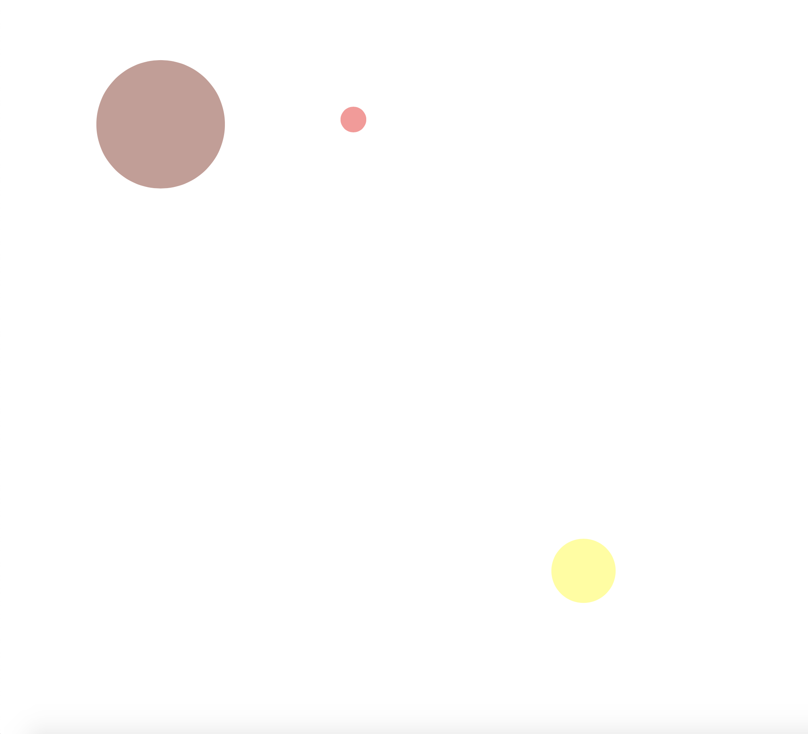

**Week 9**

This week we really started to focus on our own projects in class, rather than learning to code through Karens 'Hour of Power'. 
It was so cool to start to see what everybody had been creating in the background over the past few weeks. Everyone has taken such a different intereptaion of their texts, and how to portray them best. 

My goal this week was to really nail the class function, and make it work the way I wanted it to. Below is a screenshot of a sketch I made, the balls fall in corolation with the class and fall faster and slower depending on the mass of the ball. I am really happy with this sketch, I know just need to work out how to make the falling objects letters rather than balls. Look at the full sketch [here](https://rubybrown101.github.io/codewordsstudio/SKO1/week9/balls_falling/).

[WEEK 8])https://github.com/rubybrown101/codewordsstudio/tree/master/SKO1/week8) [WEEK 10](https://github.com/rubybrown101/codewordsstudio/tree/master/SKO1/week10)
